# 《Linux Basics for Hackers》


## 3分析和管理网络
### 1)使用 IFCONFIG 分析网络
```
[root@localhost ~]# ifconfig 
ens33: flags=4163<UP,BROADCAST,RUNNING,MULTICAST>  mtu 1500
        从flags可知该接口已启用，支持广播、组播，mtu值
        
        inet 10.10.10.140  netmask 255.255.255.0  broadcast 10.10.10.255
        IPv4地址           子网掩码               广播地址
        
        inet6 fe80::20c:29ff:fec8:ff4e  prefixlen 64  scopeid 0x20<link>
        IPv6地址                        掩码长度      作用域，link表示仅该接口有效
        
        ether 00:0c:29:c8:ff:4e  txqueuelen 1000  (Ethernet)
        网卡接口的MAC地址        传输队列长度     接口类型为Ethernet
        
        RX packets 266  bytes 26083 (25.4 KiB)
        上行表示此接口接收的报文个数，总字节数
        
        RX errors 0  dropped 0  overruns 0  frame 0
        接收报文错误数，丢弃数，溢出数，冲突的帧数
        
        TX packets 141  bytes 20086 (19.6 KiB)
        上行表示此接口发送的报文个数，总字节数
        
        TX errors 0  dropped 0 overruns 0  carrier 0  collisions 0
        发送报文错误数，丢弃数，溢出数，载荷数，冲突数

wlan0 Link encap:EthernetHWaddr 00:c0:ca:3f:ee:02
        只有当你拥有无线接口或适配器时，才会出现这种情况。
```
### 2)使用 IWCONFIG 检查无线网络设备

### 3)更改你的网络信息
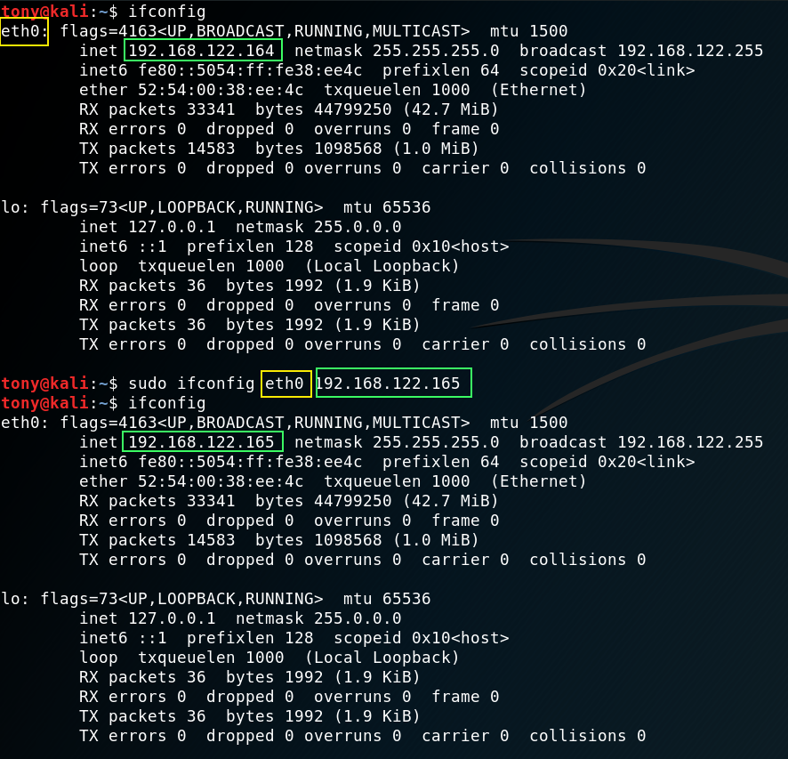
### 4)更改你的子网掩码和广播地址
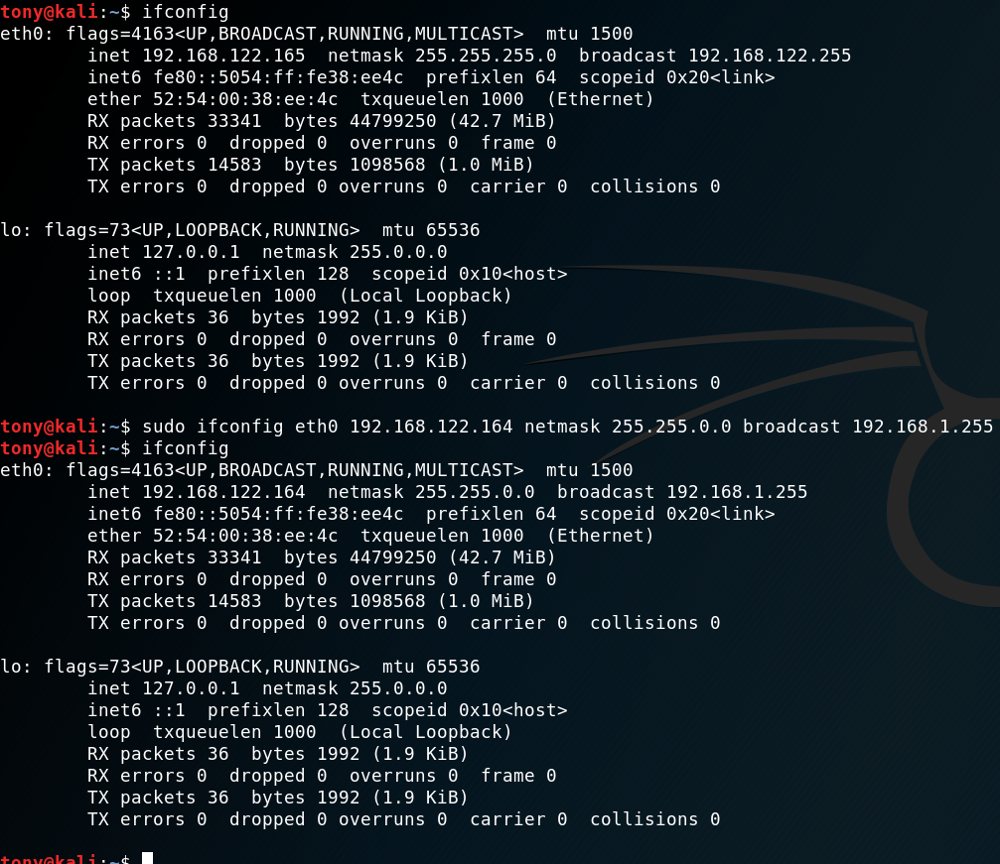

### 5)欺骗你的 MAC 地址(或者说 HWaddr)
更改你的 MAC 地址来欺骗不同的 MAC 地址几乎是很平常的操作，并且帮助你抵消这些安全措施。因此，这是一项非常有用的绕过网络访问控制技术

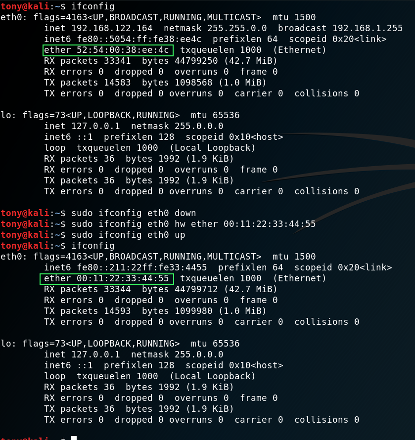

### 6)从 DHCP 服务器分配新的 IP 地址

### 7)熟练控制你的域名系统
黑客可以很容易从目标的域名系统（DNS）中找到一个信息宝库。DNS 在 internet 是一个至关重要的组成部分，尽管它的设计初衷是把域名转换成 IP 地址，但是黑客可以使用它从目标处收集信息。

#### (1)使用 dig 检测 DNS
```
dig - DNS lookup utillty
```
使用 dig 和它的 ns 选项从一个域名服务器获取信息

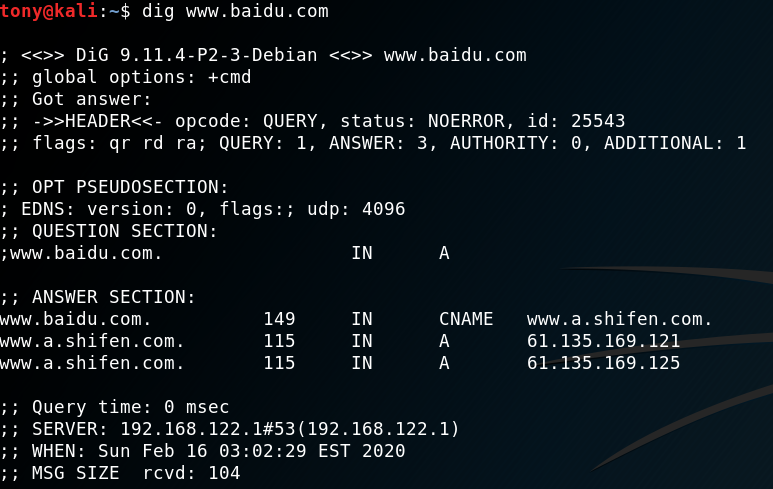

使用 dig 和它的 mx 选项来获取域名邮件交换服务器上的信息

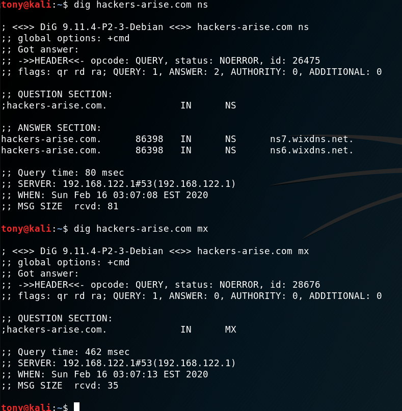

最常见的 Linux DNS 服务是 Berkeley Internet Name Domain(BIND)。在某些情况下，Linux 用户将 DNS 称为 **BIND**，但是不要混淆：DNS 和 BIND 都将各个域名映射到 IP 地址。

### 8)更改你的 DNS 服务器
在某些情况下，你可能希望使用其他 DNS 服务器。为了这么做，你将编辑一个在操作系统名为 ```/etc/resolv.conf``` 纯文本文件。
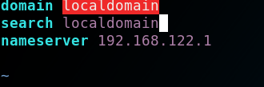

### 9)映射您自己的 IP 地址
换句话说，当你在浏览器输入 www.microsoft.com（或者其他任何域名）时，你可以决定浏览器将访问哪个 IP 地址而不是让 DNS服务决定。对于黑客，这对于劫持局域网上的 TCP 连接以使用 **dnsspoof** 等工具将流量定向到恶意 Web 服务器非常有用。

## 4.添加和删除软件 ADDING AND REMOVING SOFTWARE
### 1)搜索软件包
```
$> apt-cache search keyword
$> apt-cache search snort
```
### 2)删除软件
```bash
$> apt-get remove snort  #remove 命令不会删除配置文件
```

```bash
$> apt-get purge snort  #删除依赖和库
```
### 3)更新软件
更新（update）与升级（upgrade）不同：更新只是更新可从存储库下载的包列表，而升级将把包升级到存储库中的最新版本。

### 4)添加软件仓库到 SOURCES.LIST 文件
```
$> vim /etc/apt/sources.list
deb http://ppa.launchpad.net/webupd8team/java/ubuntu trusty main 
deb-src http://ppa.launchpad.net/webupd8team/java/ubuntu precise ma
```

## 5.控制文件和目录权限 CONTROLLING FILE AND DIRECTORY PERMISSIONS
### 1)UGO 权限改变法
虽然数值方法可能是在 Linux 中更改权限的最常用方法，但有些人发现 chmod 的符号方法更直观，两种方法同样有效，所以只需找到适合你的方法。符号方法是通常称为 UGO 语法，代表用户（或所有者），组和其他人。

UGO 语法非常简单。输入 chmod 命令，然后输入要更改权限的用户，为用户提供 u，为组提供 g，为其他用户提供 o，或者输入三个运算符之一：
> - 移除一个权限
> 
> + 添加一个权限
>
> = 设置一个
```bash
#要删除用户对 hashcat.hcstat 所属文件的写入权限
$> chmod u-w hashcat.hcstat
```

### 2)赋予默认的安全级别
Linux 自动分配基本权限（通常为文件 666 和目录 777）

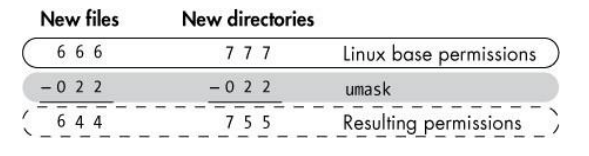

如果 umask 设置为 022，则具有原始默认权限 666 的新文件现在将具有权限 644，这意味着所有者具有读取和写入权限，并且该组和所有其他用户仅具有读取权限。

### 3)特别权限
#### (1)使用 SUID 授予临时 root 权限
要设置 SUID 位，请在常规权限之前输入 4，因此当设置 SUID 位时，具有 644 的新结果权限的文件表示为 4644。
```bash
$> chmod 4644 passwd
```

#### (2)使用 SGID 授予 Root 用户组权限
SGID 位在常规权限之前表示为 2，因此当 SGID 位置位时，具有结果权限 644 的新文件将表示为 2644。
```bash
$> chmod 2644 passwd
```
## 6.进程管理 PROCESS MANAGEMENT
一旦黑客控制了目标系统，他们可能想要找到并停止某个进程，如防病毒应用程序或防火墙。为此，黑客首先需要知道如何找到该过程。黑客可能还想设置一个扫描脚本来定期运行以查找易受攻击的系统，因此我们还将研究如何安排这样的脚本。

### 1)使用 nice 命令改变进程优先级
nice 的值范围从-20 到+19，默认值为 0

高 nice 值为低优先级，低 nice 值为高优先级

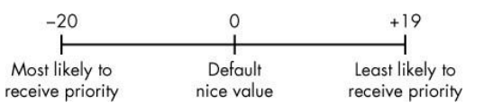

当进程启动时，它继承其父进程的 nice 值。

进程的所有者可以降低进程的优先级，但不能增加其优先级。

### 2)使用 renice 命令改变正在运行的进程优先级

### 3)kill
如果您只想使用 HUP 信号重新启动进程，请使用 kill 输入-1 选项
```bash
kali >kill -1 6996
```
对于僵尸或恶意进程，您可能发送 kill -9 信号。
```bash
kali >kill -9 6996
```
如果您不知道进程的 PID，则可以使用 killall 命令终止进程。此命令将进程的名称（而不是 PID）作为参数。例如，您可以终止假设的僵尸进程
```bash
$> killall -9 zombieprocess
```

## 8.BASH 脚本编程 BASH SCRIPTI
**nmap** :用于探测一个系统，以查看它是否连接到网络，并查明哪些端口是打开的。
```bash
nmap <type of scan> <target IP> <optionally, target port>

$> nmap -sT 192.168.181 #用 TCP 扫描 IP 地址 192.168.181.1
$> nmap -sT 192.168.181.1 -p 33 #对地址 192.168.181.1 执行 TCP 扫描，查看端口 3306 (MySQL 的默认端口)是否打开
```
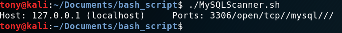

## 10.文件系统和存储设备管理 FILESYSTEM AND STORAGE DEVICE MANAGEMENT
### 1)Linux 如何表示存储设备
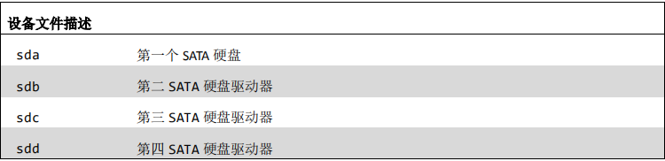
### 2)硬盘分区 
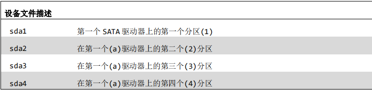

### 3)字符和块设备 
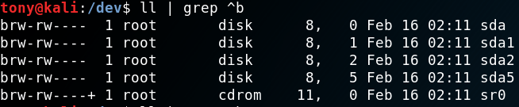
b :块设备。它们以数据块(一次多个字节)进行通信，包括硬盘驱动器和 DVD 驱动器等设备。这些设备需要更高的数据吞吐量，因此以块(一次多个字符或字节)的形式发送和接收数据。


c 代表字符，如您所料，这些设备被称为字符设备。通过逐个字符(如鼠标或键盘)发送和接收数据与系统交互的外部设备是 **字符设备**。

### 4)使用 lsblk 列出块设备和信息 
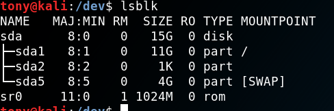

## 11.日志系统 THE LOGGING SYSTEM

配置文件 ```/etc/rsyslog.conf```

### 1）删除证据——shred
```bash
$> shred -f -n 10 /var/log/auth.log.*   #将/var/log/auth.log 中的日志文件分解覆盖 10 次
一个是-f 选项，它更改文件的权限，以便在需要更改权限时允许覆盖；另一个是-n 选项，它允许您选择覆盖文件的次数。
```

## 12.熟练使用服务 USING AND ABUSING SERVIC
**服务**是在后台运行的应用程序，等待您使用它。
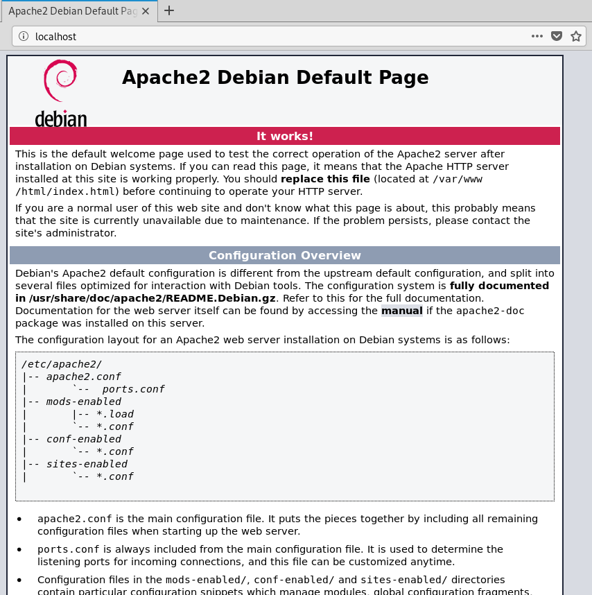
### 1)PostgreSQL 与 Metasploit
PostgreSQL，或 Postgres，是另一个开源关系数据库，由于其能够轻松扩展并处理繁重的工作负载，因此常用于非常大的互联网应用程序。它于 1996 年 7 月首次发布，由一大批名为 PostgreSQL 全球开发组的开发人员维


## 13.安全和匿名 BECOMING SECURE AND ANONYMO
今天，几乎我们在互联网上做的一切都被跟踪。无论是谷歌跟踪我们的在线搜索、网站访问和电子邮件，还是美国国家安全局(NSA)对我们的所有活动进行编目，无论谁在跟踪我们，我们的每一次在线活动都会被记录、编入索引，然后被挖掘出来，以造福他人。普通个人，尤其是黑客，需要了解如何限制这种跟踪，并在网上保持相对匿名，以限制这种无处不在的监视。

没有一种方法能保证你的活动不被窥探，如果有足够的时间和资源，任何事情都能被追踪。然而，这些方法可能会使跟踪器的工作更加困难。

### 互联网是如何出卖我们的
您的 IP 地址标识您在互联网上的身份。从您的机器发送的数据通常会被标记为您的 IP 地址，从而使您的活动易于跟踪。其次，谷歌和其他电子邮件服务将“阅读”您的电子邮件，寻找关键词，以更有效地为您服务广告。让我们先来看看 IP 地址是如何在互联网上泄露信息的。

当您通过互联网发送数据包时，它包含数据的源和目标的 IP 地址。通过这种方式，数据包知道它要去哪里以及在哪里返回响应。每个数据包通过多个互联网路由器跳转，直到找到它的目的地，然后跳转回发送方。对于一般的互联网冲浪，每一跳都是数据包通过路由器到达目的地。发送方和目的地之间可以有多达 20-30 跳，但通常任何数据包在不到 15 跳的时间内就能找到到达目的地的路径。

```bash
#需输入 traceroute 和目标 IP 地址或域，该命令将向目标发送数据包并跟踪这些数据包的路由
$> traceroute www.baidu.com
```
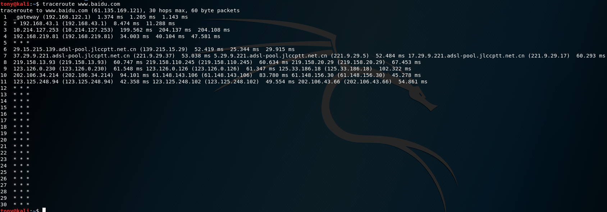

### 1)The Onion Network
#### (1)Tor 是如何工作的
通过 Tor 发送的数据包不是通过常规路由器发送的，而是通过全世界 7000 多台路由器组成的网络发送的，这要感谢志愿者们允许 Tor 使用他们的计算机。

在使用完全独立的路由器网络的基础上，Tor 加密每个数据包的数据、目的地和发送方 IP 地址。在每一跳，接收到的信息被加密，然后在下一跳被解密。这样，每个包只包含关于路径上的前一跳的信息，而不包含源的 IP 地址。如果有人拦截流量，他们只能看到上一跳的 IP 地址，网站所有者只能看到发送流量的最后一个路由器的 IP 地址(参见图 13-1)，这确保在互联网上的相对匿名性。

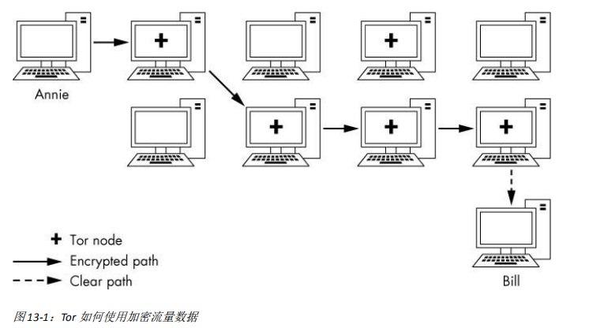


要启用 Tor，只需从 [https://www.torproject.org/](https://www.torproject.org/)安装 Tor 浏览器。

例如，NSA 运行自己的 Tor 路由器，这意味着当您使用 Tor 时，您的流量可能正在通过 NSA 的路由器。如果您的流量正在退出 NSA 的路由器，那就更糟了，因为退出路由器总是知道您的目的地。NSA 还有一种被称为“流量关联”(traffic correlation)的方法，该方法涉及寻找进出流量的模式，能够打破 Tor 的匿名性。虽然这些破解 Tor 的尝试不会影响 Tor 在商业服务(如 Google)中隐藏您身份的有效性，但它们可能会限制浏览器在间谍机构中保持匿名的有效性。


### 2)洋葱网络

### 3)代理服务器

### 4)虚拟专用网络

### 5)私有加密的电子邮件

## 14.理解和检查无线网络 UNDERSTANDING AND INSPECTING WIRELESS NETWORKS
### 1)WI-FI （IEEE 802.1）
**AP (access point)** 这是无线用户连接到互联网的设备。

**ESSID (extended service set identifier)** 这和我们在第三章讨论到的 SSID 相同，不过它可以用于无线局域网中的多个 AP 中。

**BSSID (basic service set identifier)** 这是每个 AP 的唯一标识符，与设备的 MAC 地址相同。

**SSID (service set identifier)** 这是网络的名称。

**Channels Wi­Fi** 可以在 14 个信道（1-14）中的任何一个信道上工作。在美国，Wi-Fi 被限制在信道 1到 11。

**Power** 你距离 WI-Fi AP 越近,功率越大，连接越容易破解。

**Security** 这是正在读取的 WiFi AP 上使用的安全协议。 WiFi 有三种主要的安全协议。 最初的有线等效保密（WEP）存在严重缺陷，容易破解。它的替代品，WiFi 保护访问（WPA），更安全一点。最后，WPA2-PSK更加安全并且使用所有用户共享的预共享密钥（PSK），现在几乎所有 WiFi AP（企业 WiFi 除外）都使用它。

**Modes Wi­Fi** 可以在三种模式下切换：managed, master, 或者 monitor。你将在下一节中了解这些模式的含义。

**Wireless range** 在美国，Wi-Fi AP 必须合法地以 0.5 瓦的上限广播其信号。 在此功率下，它具有约300 英尺（100 米）的正常范围。 Highgain 天线可以将此范围扩展到 20 英里。

**Frequency Wi­Fi** 被设计用于 2.4GHz 和 5GHz。 现代 Wi-Fi AP 和无线网卡经常使用这两


